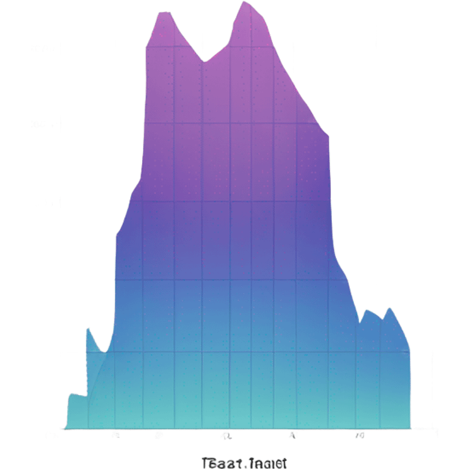
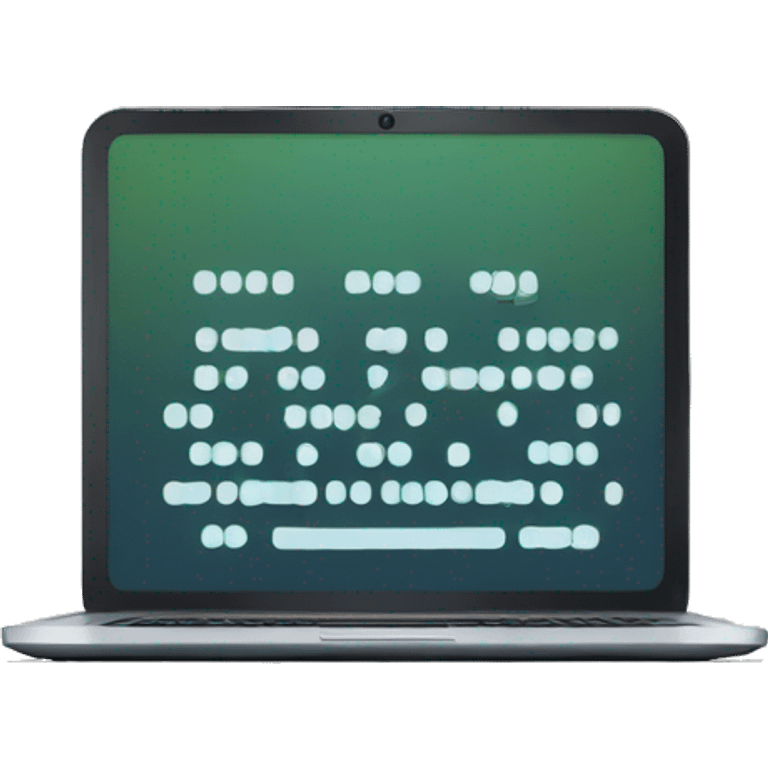
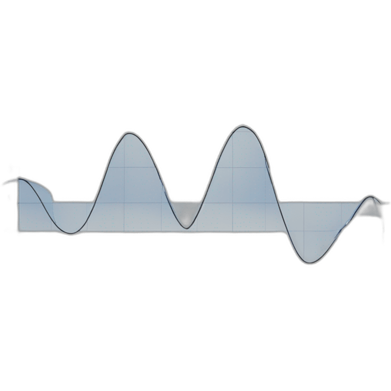
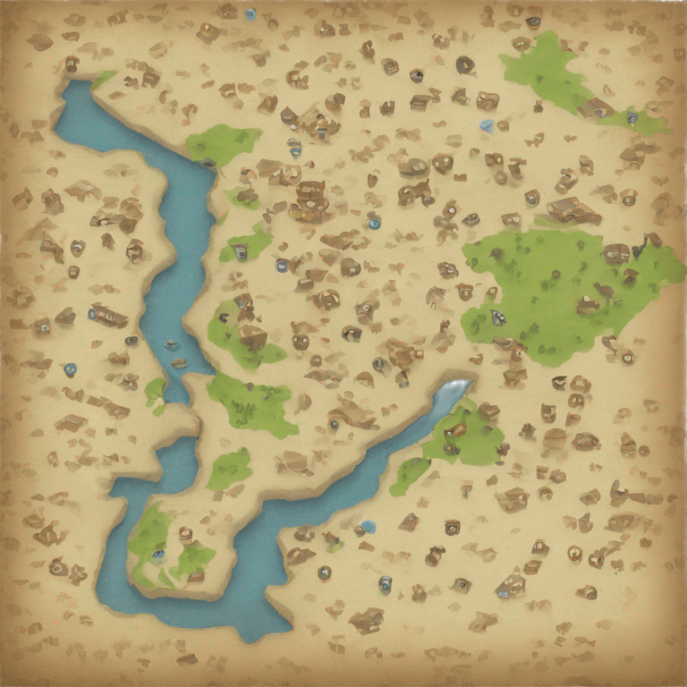

<h1 align="center"> Welcome to my github</h1> 

### A little bit about me: 
I am involved in Data science (machine learning and data analytics). I am actively developing various ML and DA projects.

### Social resources and communication: 
You can find out more about me from my SNS.

 

### Hobbies: 
· Books   
· Development and opensource   
· Painting and drawing   
· Math    
· Mapping in OSM   
